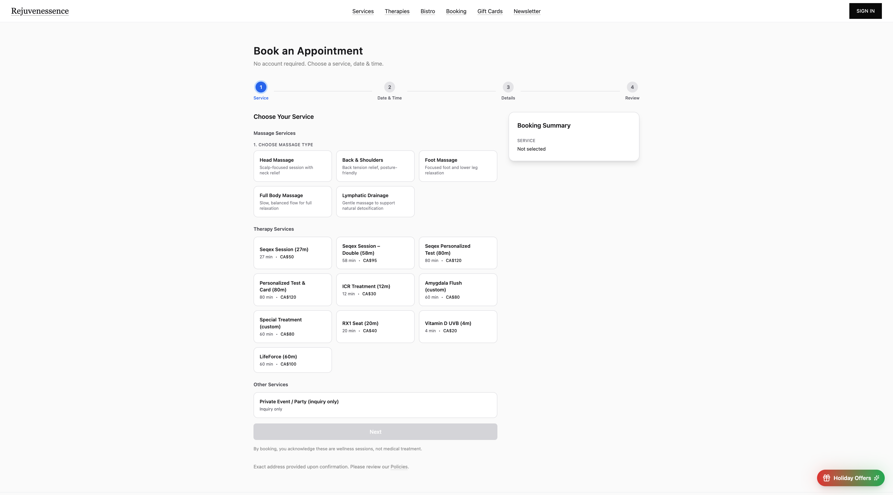
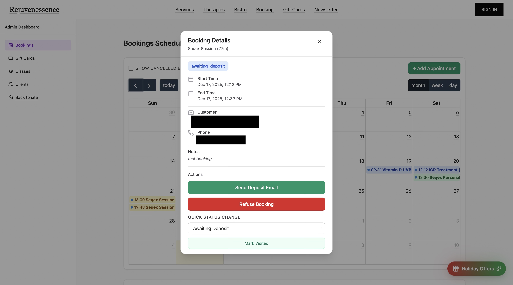
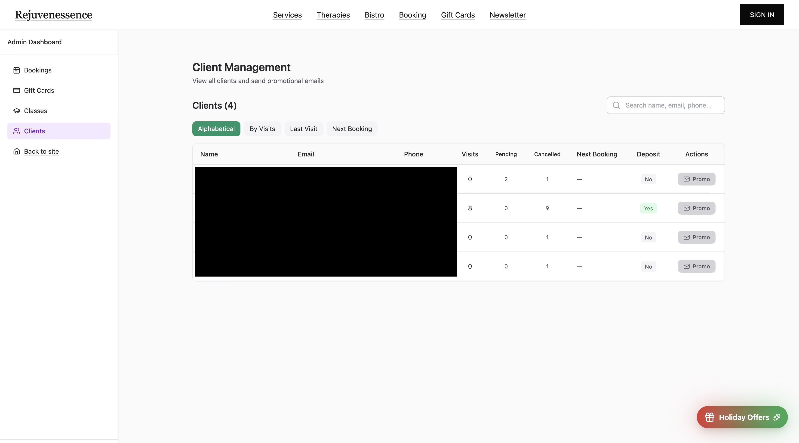
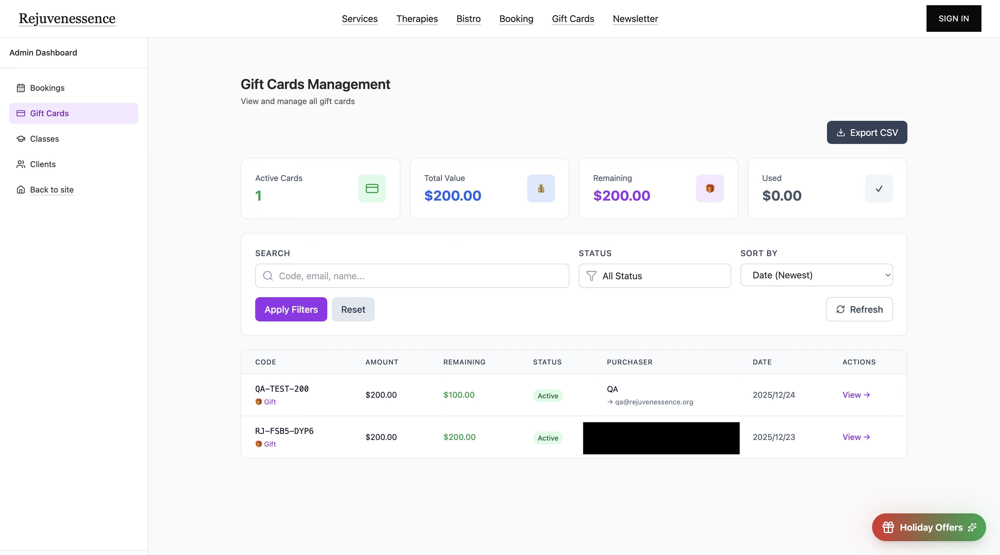

# Rejuvenessence — 商用预约与礼品卡平台（Next.js + Supabase）

为私人健康工作室开发的生产级 Web 应用，整合营销官网、在线预约、Stripe 礼品卡购买，以及内部管理后台。

## 线上地址
- 生产环境：https://rejuvenessence.org  
- 预览/测试：https://r-spa-site.vercel.app  

---

## 简历式亮点
- 基于 Next.js App Router + Supabase（Postgres/Auth/RLS）构建全栈预约与礼品卡平台，部署于 Vercel
- 实现预约冲突检测，在确认前阻断时间段重叠
- 使用 Supabase RLS 实现角色隔离，区分用户预约与管理员操作权限
- 完成事务性邮件流程（客户 + 商家），支持日历邀请（.ics）附件
- 在同一代码库中构建内部管理工具：预约管理、客户/备注、礼品卡追踪

---

## 功能概览

### 用户端
- 多页面营销站（服务介绍、政策说明、常见问题）
- 预约流程：选择服务/日期/时段 → 填写信息 → 确认/取消/修改
- 事务性邮件通知（客户 + 商家），含日历邀请（.ics）
- 礼品卡购买（Stripe Checkout）

### 管理端（需登录）
- 预约管理：状态、备注、客户信息
- 押金请求流程（邮件触发）
- 客户列表：到访记录、内部备注
- 礼品卡管理：购买追踪、核销

---

## 技术栈
- **前端：** Next.js（App Router）、React、TypeScript、TailwindCSS  
- **后端：** Supabase（Postgres + Auth + RLS + RPC）、Next.js API Routes、Zod 参数校验
- **支付：** Stripe Checkout + Webhook（幂等处理）
- **邮件：** Zoho SMTP + Resend 降级、outbox 审计、.ics 附件
- **部署：** Vercel

---

## 架构概览
- **Web 应用（Next.js）：** 营销页面 + 预约界面 + 管理后台
- **API Routes / Server Actions：** 预约创建/更新、管理操作、邮件发送
- **数据库（Supabase Postgres）：** 预约、客户、礼品卡、审计/元数据
- **鉴权 + RLS：** 管理员工作流 + 策略级数据访问控制
- **支付（Stripe）：** 礼品卡结账流程 + 支付后处理
- **邮件：** Zoho SMTP + Resend 降级，确认/运营邮件 + .ics 附件

---

## 工程亮点
- **预约冲突检测：** SQL 时间段重叠查询，提交前阻断冲突预约
- **行级安全（RLS）：** 用户数据隔离 + 服务端特权操作配合审计
- **支付幂等：** Webhook 处理通过幂等键避免重复回写
- **可审计邮件系统：** 双通道投递（Zoho + Resend），所有发送记录写入 outbox 便于排障
- **礼品卡状态机：** 安全兑换流程（唯一 code + 临时 token + 两步验证）
- **单代码库：** 管理工具内置（日历、预约管理、礼品卡运营）

---

## 截图

### 预约流程


### 礼品卡结账


### 管理后台（预约）


### 客户管理


### 礼品卡管理


---

## 本地开发

### 安装与运行
```bash
npm install
cp .env.example .env.local
npm run dev
```

### 环境变量
参考 `.env.example` / `.env.production.example` 配置。
- 服务端密钥（如 Supabase service role key、Stripe secret key）仅在服务端使用
- 敏感值不要使用 `NEXT_PUBLIC_` 前缀暴露给客户端

### 安全与隐私说明
- 本仓库不存储生产环境密钥
- 运营文档与数据库迁移文件已排除在公开仓库之外
- 截图如包含敏感信息需做脱敏处理

### 后续规划
- 可用时段 UI 完全由数据库驱动
- 多语言支持
- 自动化测试（单元 + e2e）
